# LAB7WEB
Nama : Abdus Shomad
NIM : 312110089
Kelas : TI.21.B1
Membuat program PHP menggunakan form yang bisa menampilkan 
nama, pekerjaan dan  umur dari tanggal lahir.
INI HASIL PRAKTIKUM LAB 7 BESERTA SINTAXNYA
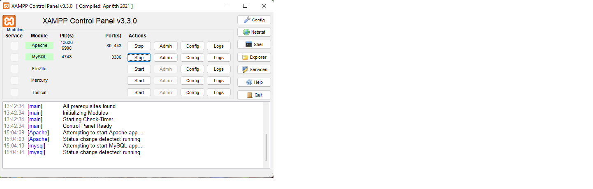
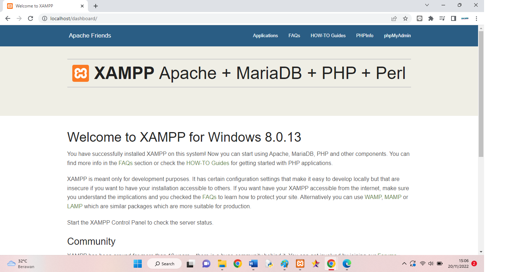
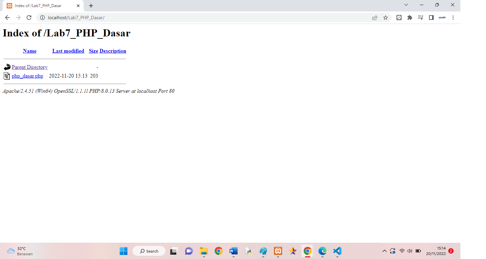
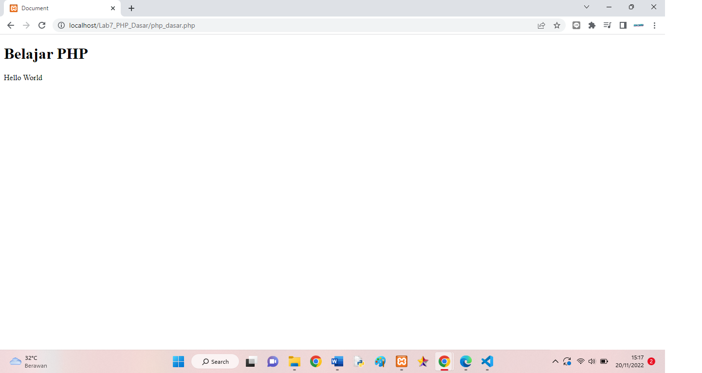
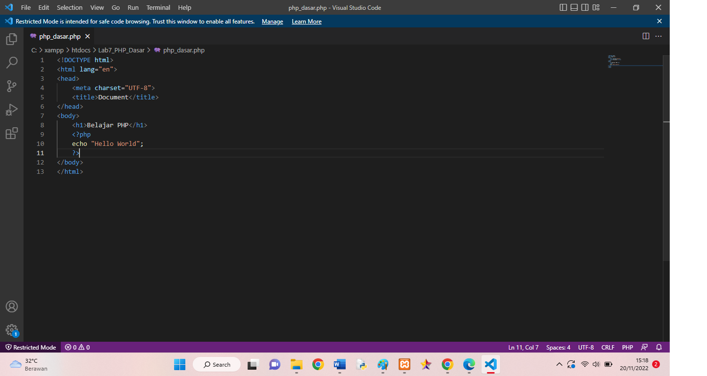
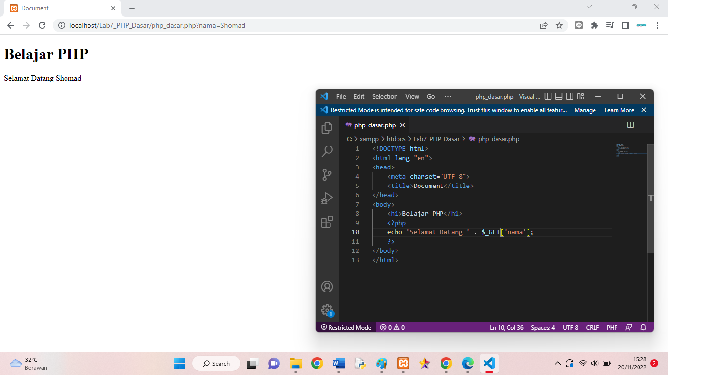

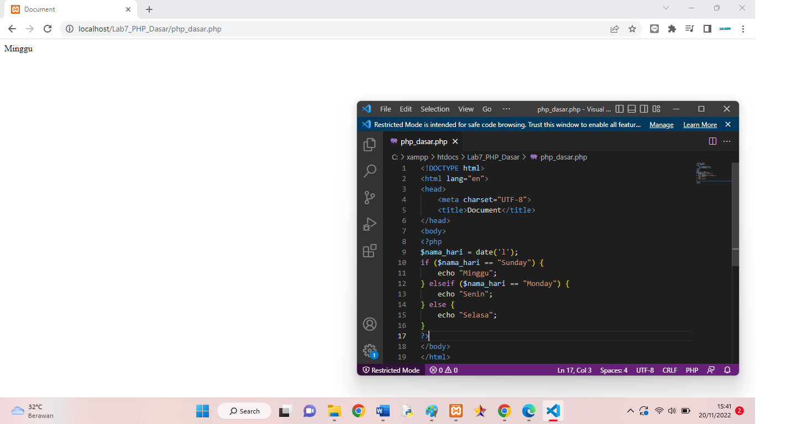
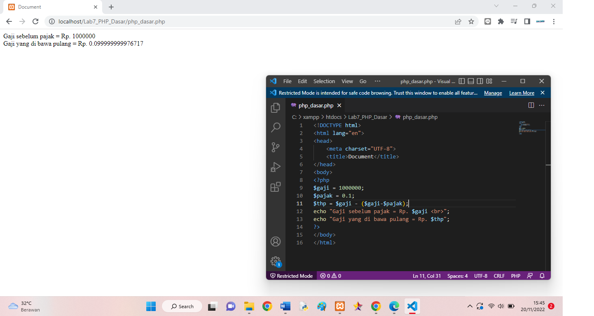
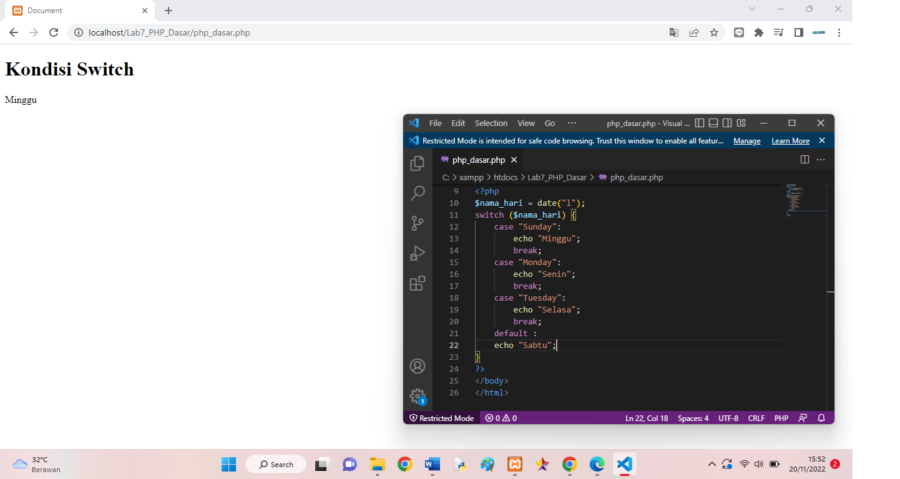
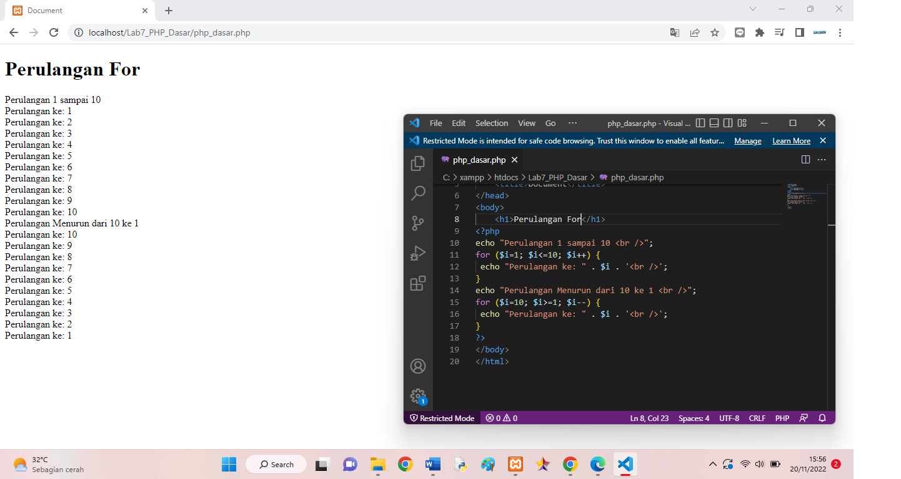
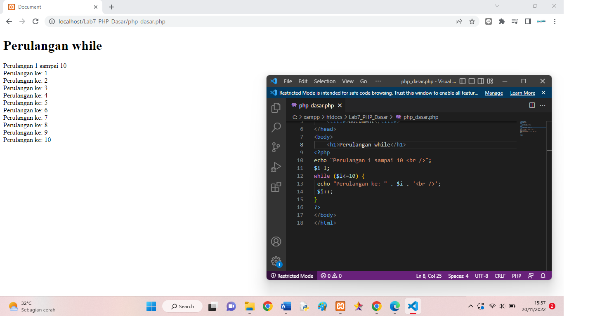
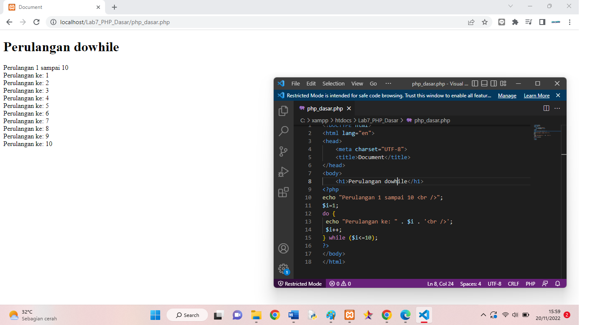
INI HASIL DARI TUGAS
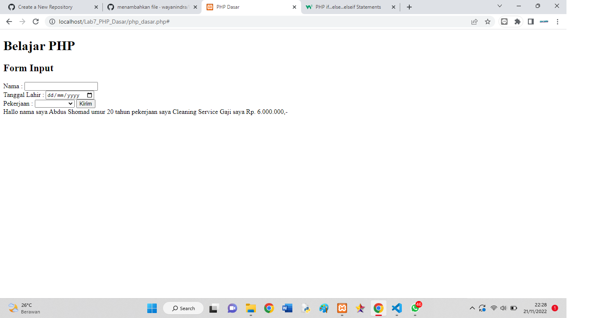
INI SINTAX PROGRAN PHPNYA
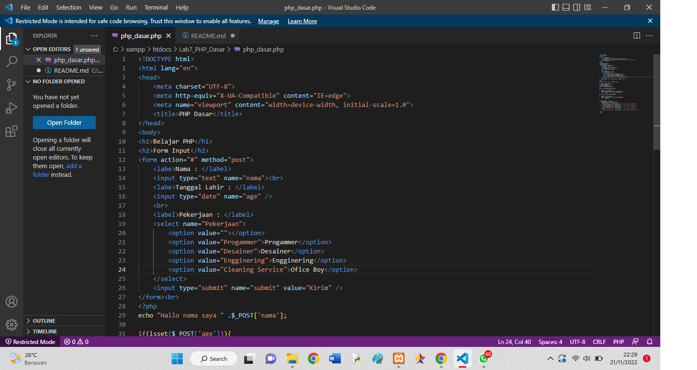
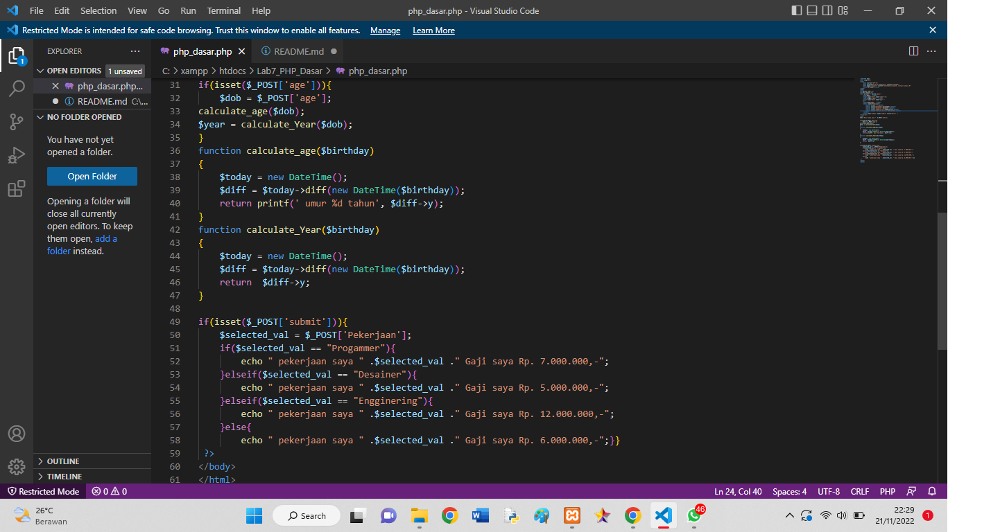